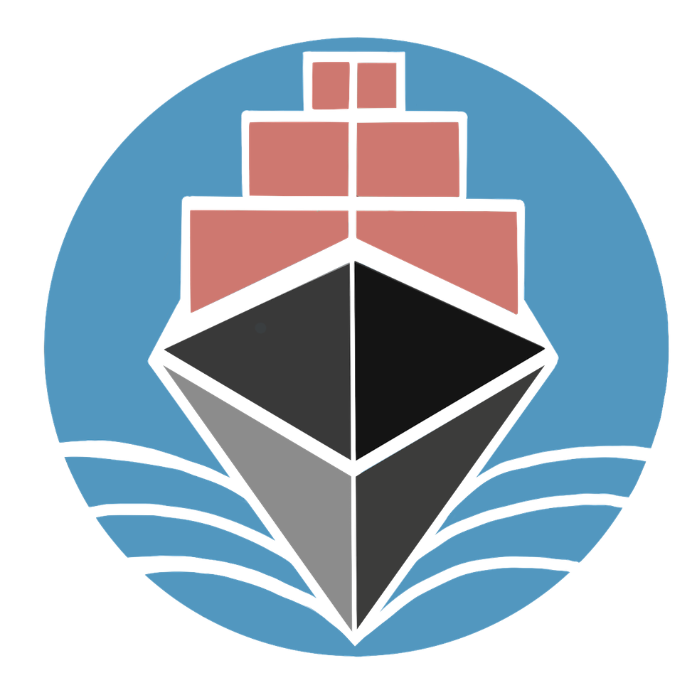

<div style="text-align:center">

<h1> Crowdtainer Solidity smart contracts</h1> </div>
<br/>


## Functionality and design

This repository contains all solidity code related to the core functionality of crowdtainer.

See [`Crowdtainer smart contracts system`](./UserStories.md) for description and User Stories.

## Installing dependencies

#### Install Nix

```sh
# For Linux users:
sh <(curl -L https://nixos.org/nix/install) --daemon

# Run this or login again to use Nix
. "$HOME/.nix-profile/etc/profile.d/nix.sh"

# For MacOS users:
sh <(curl -L https://nixos.org/nix/install) --darwin-use-unencrypted-nix-store-volume --daemon
# In case of MacOS arm (M1) issues, you may want to run everything under Rosetta.
vi ~/.config/nix/nix.conf
# set:
system = x86_64-darwin
nix-env -iA ghc -f $(curl -sS https://api.github.com/repos/dapphub/dapptools/releases/latest | jq -r .tarball_url)
# Then, restart your terminal/shell session to make the installation effective.
```


#### Install DappTools

```sh
curl https://dapp.tools/install | sh
```


#### Install Foundry

```
curl -L https://foundry.paradigm.xyz | bash

# Reload your terminal enviroment variables, e.g.:
source ~/.zshrc

foundryup

# MacOS might also require:
brew install libusb
```

## Building and testing

There are currently two different tools that are able to build & execute tests in this repository: DappTools and Foundry.

Foundry is recommended for getting started, since it is easier to install, and faster to execute tests with. However, it is not yet as feature complete as DappTools, namely, it doesn't support formal verification (yet).


```sh
git clone --recursive https://github.com/crowdtainer/dapp-contracts
cd dapp-contracs
make         # Also installs project dependencies

# To run dapp-tools based tests (Unit testing, Fuzz and Symbolic):
make test

# To see unit test code coverage:
make coverage

# To run Solidity' SMTChecker-based tests:
make solcheck

# Estimation of gas costs:

- First run a local testnet with `dapp testnet`.
- Then run e.g.: `make contract=Crowdtainer estimate`

# Contract size estimation:
- Example: `make contract=Vouchers721 size`

```

## Contributing

### To apply linter:
```sh
make lint
```
## Deploying

Contracts can be deployed via the `make deploy` command. Addresses are automatically
written in a name-address json file stored under `out/addresses.json`. Additionally, you can specify a specific network with `make deploy-rinkeby` or `make deploy-mainnet`. You can choose which contract you want to deploy, by adding it as a variable, e.g.:

 ```bash
 make deploy-rinkeby CONTRACT=Crowdtainer
 ```

### Local Testnet

```
# To spin up a local testnet:
dapp testnet

```
Make sure ETH_FROM is set according to the address returned by dapp testnet above in `.dapprc` file.

```
# Then in a second terminal:
make deploy
```

### Local deploy test

[`scripts/test-deploy.sh`](./scripts/test-deploy.sh) will launch a local testnet, deploy the contracts, and do some sanity checks.

Environment variables under the `.env` file are automatically loaded (see [`.env.example`](./.env.example)).
Be careful of the [precedence in which env vars are read](https://github.com/dapphub/dapptools/tree/2cf441052489625f8635bc69eb4842f0124f08e4/src/dapp#precedence).

We assume `ETH_FROM` is an address you own and is part of your keystore.
If not, use `ethsign import` to import your private key.

We use Alchemy as a remote node provider for the Mainnet & Rinkeby network deployments.
You must have set your API key as the `ALCHEMY_API_KEY` enviroment variable in order to
deploy to these networks

### Mainnet

```
ETH_FROM=0x3538b6eF447f244268BCb2A0E1796fEE7c45002D make deploy-mainnet
```

### Rinkeby

```
ETH_FROM=0x3538b6eF447f244268BCb2A0E1796fEE7c45002D make deploy-rinkeby
```

### Custom Network

```
ETH_RPC_URL=<your network> make deploy
```
